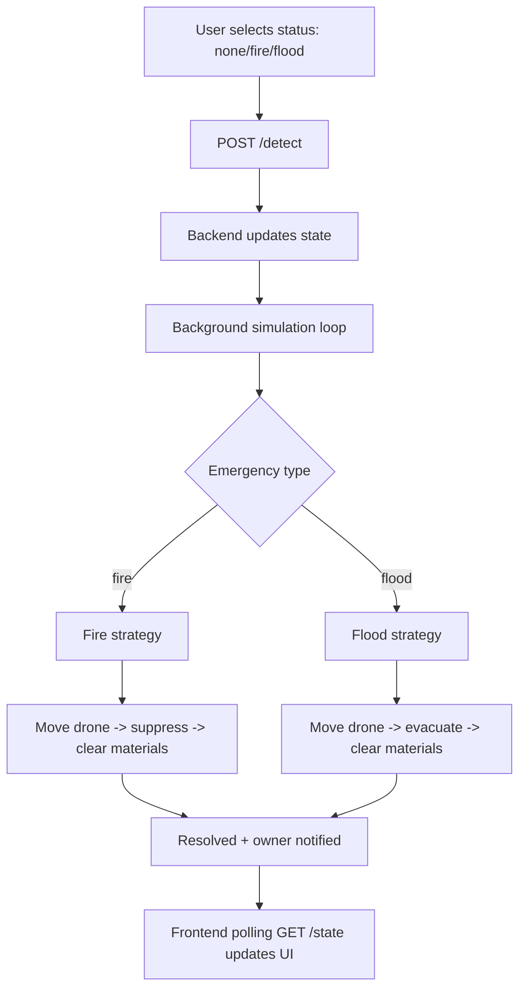
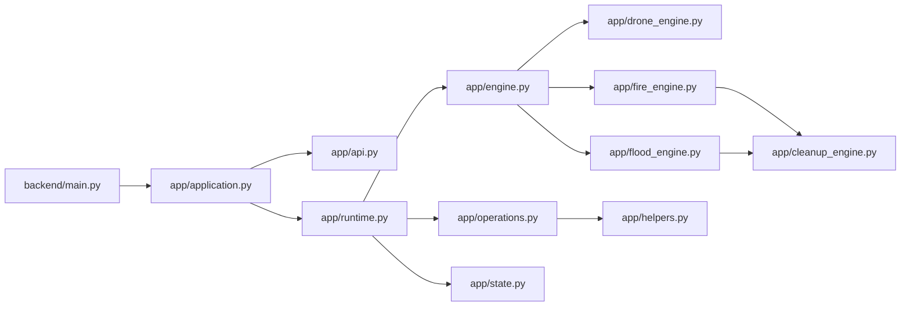
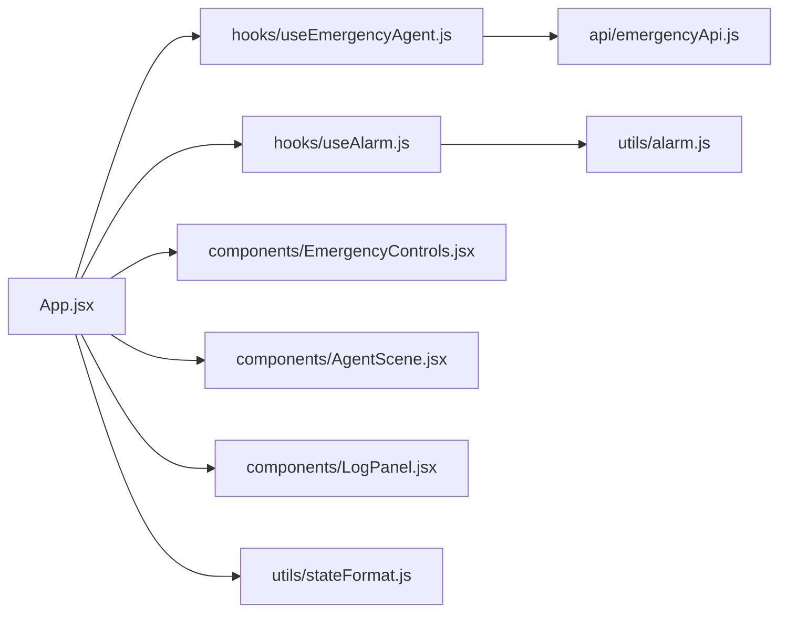
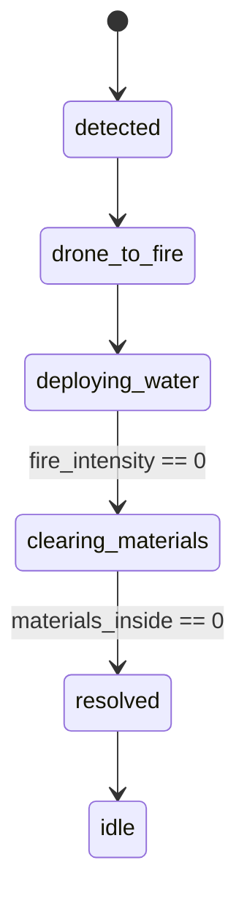
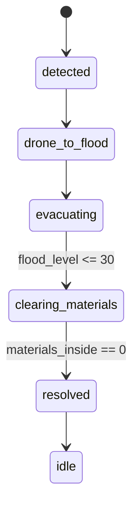

# Home Emergency Agent - System Documentation

## 1) Problem We Are Solving

This project simulates an **autonomous home emergency response agent**.

The problem:
- A home can enter emergency states (`fire` or `flood`).
- The system should not wait for manual button actions.
- Once status changes, the agent should automatically:
  - dispatch a drone,
  - run the correct response flow,
  - evacuate materials from affected area,
  - log events and simulated owner notifications.

The goal is to provide a clear, observable simulation of autonomous emergency handling from detection to resolution.

## 2) High-Level Flow



## 3) Backend Architecture



## 4) Frontend Architecture



## 5) Detailed Autonomous State Flow

### Fire


### Flood


## 6) Run Commands (Backend + Frontend)

Open **2 terminals**.

### Terminal 1: Backend
From project root:
```powershell
cd backend
python -m pip install -r requirements.txt
uvicorn main:app --reload --port 8000
```

Alternative from project root:
```powershell
python -m pip install -r backend\requirements.txt
uvicorn backend.main:app --reload --port 8000
```

### Terminal 2: Frontend
```powershell
cd frontend
npm install
npm run dev
```

Frontend runs on `http://localhost:5173` and proxies `/api` to backend `http://localhost:8000`.

## 7) Main Files and What We Implemented

### Backend
- `backend/main.py`
  - Thin entrypoint, creates FastAPI app.
- `backend/app/application.py`
  - App factory, CORS, lifecycle startup/shutdown.
- `backend/app/api.py`
  - Public API routes (`GET /state`, `POST /detect`).
- `backend/app/runtime.py`
  - Runtime coordinator, lock-protected state access, simulation task loop.
- `backend/app/engine.py`
  - High-level dispatch: drone update + emergency-specific strategy call.
- `backend/app/fire_engine.py`
  - Fire autonomous logic.
- `backend/app/flood_engine.py`
  - Flood autonomous logic.
- `backend/app/drone_engine.py`
  - Drone movement and arrival checks.
- `backend/app/cleanup_engine.py`
  - Material evacuation completion logic.
- `backend/app/operations.py`
  - Detection/state transition initialization.
- `backend/app/helpers.py`
  - Logging + simulated owner notification helper.
- `backend/app/state.py`
  - Initial state schema (runtime state dictionary).
- `backend/app/constants.py`
  - Reused simulation coordinates/constants.

### Frontend
- `frontend/src/App.jsx`
  - Main container, binds hooks and UI components.
- `frontend/src/hooks/useEmergencyAgent.js`
  - Polls backend state and triggers detect call on status change.
- `frontend/src/api/emergencyApi.js`
  - API wrapper for `/state` and `/detect`.
- `frontend/src/hooks/useAlarm.js` + `frontend/src/utils/alarm.js`
  - Emergency alarm sound behavior.
- `frontend/src/components/EmergencyControls.jsx`
  - Status selector + key telemetry widgets.
- `frontend/src/components/AgentScene.jsx`
  - Visual simulation scene (house, fire/flood animation, drone, materials).
- `frontend/src/components/LogPanel.jsx`
  - Event/owner notification log display.
- `frontend/src/utils/stateFormat.js`
  - UI state helpers (status class, alarm text, initial state).
- `frontend/src/index.css`
  - Styling and animations.

## 8) Notes About Current Behavior

- System is now **autonomous only** (manual action buttons removed).
- `reset` endpoint/UI reset control removed.
- Owner communication is simulated through logs via `Owner notified (simulation): ...`.


  python -m pip install -r backend\requirements.txt  
  uvicorn backend.main:app --reload --port8000 

   # Backend                                        
  python -m pip install -r backend\requirements.txt  uvicorn backend.main:app --reload --port 8000 


  codex resume 019cba4b-f745-79c0-9bd0-9672e9e43e34